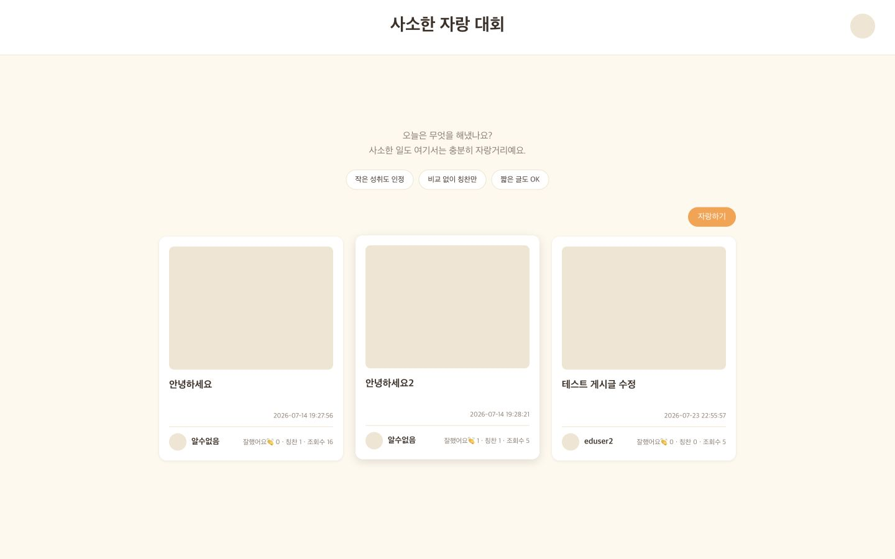
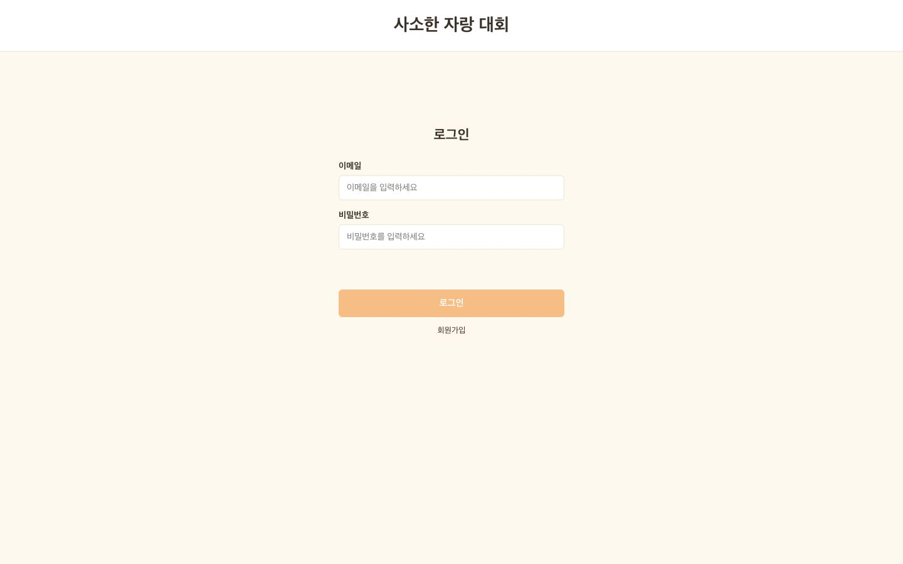
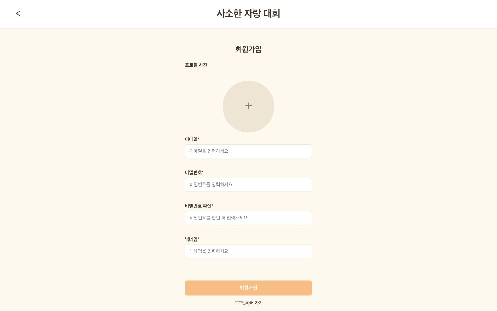
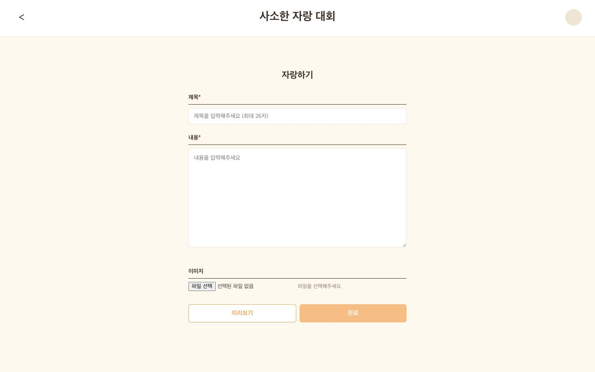
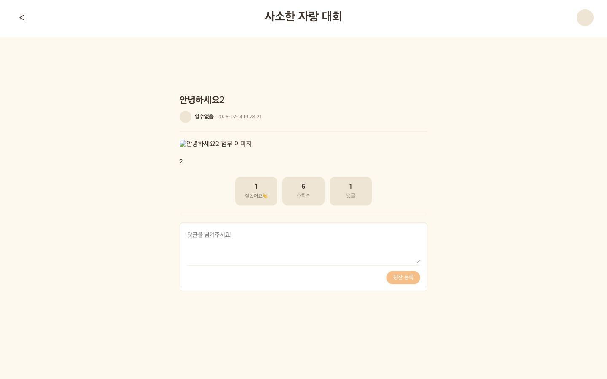
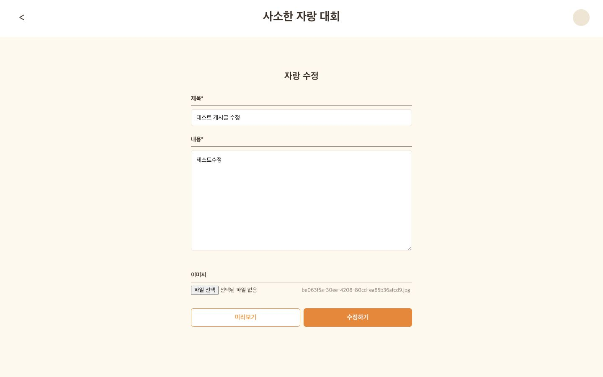
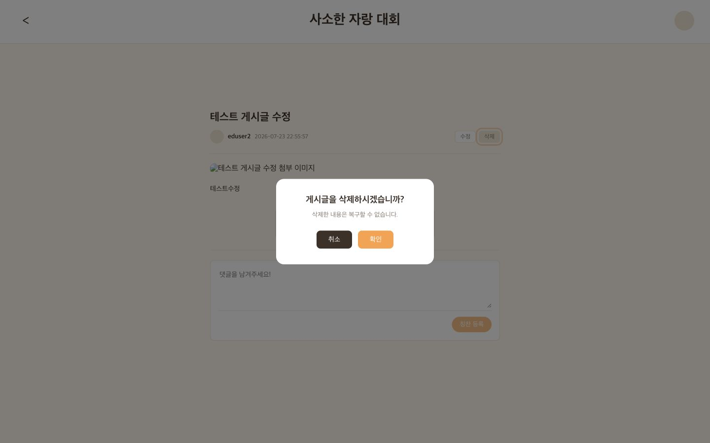
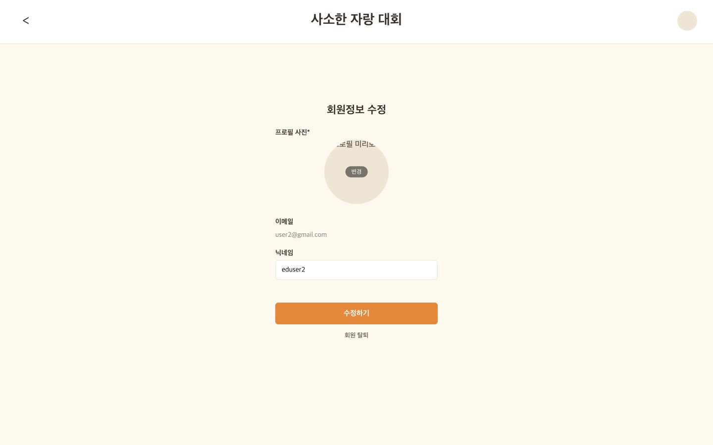
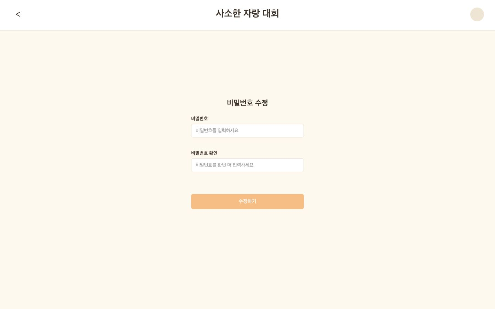
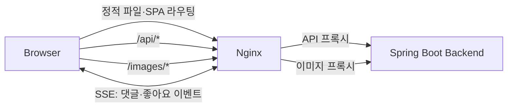

# 사소한 자랑 대회 — Frontend

일상의 작지만 자랑하고 싶은 순간을 게시글로 나누는 커뮤니티 서비스의 프론트엔드입니다.
React와 Vite로 구현했으며, 회원 관리부터 게시글·댓글·좋아요·이미지 기능까지 하나의 웹 애플리케이션에서 제공합니다.

백엔드 저장소: [KTB_Lina_Week12_BE](https://github.com/100-hours-a-week/KTB_Lina_Week12_BE)

## 개발 인원 및 기간

- 개발 기간: 2026-05-26 ~ 2026-08-09
- 개발 인원: 프론트엔드·백엔드 1명 (박소현)

## 구현 기능

- 회원가입, 로그인, 로그아웃 및 JWT 기반 로그인 상태 유지
- 비회원·회원 전용 라우트 분리와 인증 만료 처리
- 프로필 이미지·닉네임·비밀번호 수정 및 회원 탈퇴
- 게시글 목록 페이지네이션과 상세 조회
- 게시글 작성·수정·삭제 및 이미지 업로드
- 댓글 작성·수정·삭제와 게시글 좋아요
- SSE(Server-Sent Events)를 이용한 댓글·좋아요 실시간 반영
- 반응형 UI, 입력값 검증, 삭제 확인 모달 및 오류 상태 안내

## 사용 기술 및 Tools

| 구분 | 기술 |
| --- | --- |
| UI | React 19, CSS |
| 빌드 | Vite 8 |
| 라우팅 | React Router 7 |
| 통신 | Fetch API, EventSource(SSE) |
| 인증 | JWT, Local Storage |
| 품질 관리 | Oxlint, Node.js Test Runner |
| 배포 | Nginx, Docker, GitHub Actions, GHCR |

## 서비스 시연 영상

GitHub README에서는 저장소의 동영상이 화면 안에서 바로 재생되지 않습니다.
아래 미리보기 이미지 또는 재생 링크를 클릭하면 웹 브라우저에서 전체 영상을 확인할 수 있습니다.

[](https://raw.githubusercontent.com/100-hours-a-week/KTB_Lina_Week12_FE/main/docs/videos/service-demo.mp4)

### [▶ 시연 영상 재생하기](https://raw.githubusercontent.com/100-hours-a-week/KTB_Lina_Week12_FE/main/docs/videos/service-demo.mp4)

## 서비스 화면

### 로그인 및 회원가입

| 로그인 | 회원가입 |
| --- | --- |
|  |  |

### 게시글 목록 및 작성

| 게시글 목록 | 게시글 작성 |
| --- | --- |
|  |  |

### 게시글 상세 및 수정

| 게시글 상세·댓글·좋아요 | 게시글 수정 |
| --- | --- |
|  |  |

### 삭제 및 회원정보 관리

| 게시글 삭제 확인 | 회원정보 수정·회원 탈퇴 |
| --- | --- |
|  |  |

### 비밀번호 수정



## 동작 구조



로컬 개발에서는 Vite가 `/api`와 `/images` 요청을 `http://localhost:8080`으로 프록시합니다. 운영 환경에서는 Nginx가 React 정적 파일을 제공하고 같은 경로의 요청을 백엔드로 전달합니다.

## 폴더 구조

```text
.
├── .github/workflows/ci.yml   # 검사, 빌드, 이미지 배포
├── deploy/direct/nginx/       # EC2 직접 배포용 Nginx 설정
├── nginx/default.conf         # 컨테이너용 Nginx 설정
├── src
│   ├── api/                   # 사용자·게시글·이미지 API
│   ├── components/            # 공통 UI 컴포넌트
│   ├── config/                # API 기본 경로
│   ├── context/               # 인증 전역 상태
│   ├── hooks/                 # 공통 훅
│   ├── layouts/               # 인증 사용자 레이아웃
│   ├── pages/                 # 라우트별 페이지
│   ├── realtime/              # SSE 구독과 상태 반영
│   └── routes/                # Guest/Protected Route
├── Dockerfile
├── package.json
└── vite.config.js
```

## 로컬 실행

### 요구 사항

- Node.js 22 이상
- npm
- `http://localhost:8080`에서 실행 중인 백엔드

### 설치 및 실행

```bash
git clone https://github.com/100-hours-a-week/KTB_Lina_Week12_FE.git
cd KTB_Lina_Week12_FE
npm ci
cp .env.example .env
npm run dev
```

브라우저에서 `http://localhost:5173`에 접속합니다.

### 환경 변수

| 이름 | 기본값 | 설명 |
| --- | --- | --- |
| `VITE_API_BASE_URL` | `/api` | 브라우저에서 사용할 API 기본 경로 |

백엔드가 다른 주소에 있다면 `.env`의 값을 변경할 수 있습니다. 같은 출처 기반의 `/api` 사용을 권장합니다.

## 명령어

| 명령어 | 설명 |
| --- | --- |
| `npm run dev` | Vite 개발 서버 실행 |
| `npm run lint` | Oxlint 정적 검사 |
| `npm test` | 실시간 상태 처리 단위 테스트 |
| `npm run build` | 운영용 정적 파일 빌드 |
| `npm run preview` | 빌드 결과 로컬 미리보기 |

제출 전 검증:

```bash
npm run lint
npm test
npm run build
```

## 배포

Nginx가 React 정적 파일을 제공하고 `/api`, `/images`, SSE 요청을 Spring Boot로 프록시합니다. GitHub Actions는 lint와 build 통과 후 `main` 브랜치의 Docker 이미지를 GHCR에 게시하며, 실제 통합 배포는 백엔드 저장소의 Docker Compose가 담당합니다.

```bash
docker build -t community-frontend:local .
```

## 트러블 슈팅

### SSE 이벤트 중복 반영 방지

SSE는 네트워크 재연결이나 동일 이벤트 재수신 가능성이 있어 새 댓글을 무조건 배열에 추가하면 화면에 중복으로 표시될 수 있습니다. 댓글 ID를 기준으로 기존 항목을 탐색하고, 이미 존재하면 교체하고 없으면 추가하는 방식으로 상태 변경을 멱등하게 만들었습니다. 이 로직은 `postEventState.js`로 분리해 Node.js Test Runner로 검증했습니다.

### API와 실시간 연결의 동일 출처 구성

개발·운영 환경마다 백엔드 주소를 화면 코드에 직접 넣으면 CORS와 배포 설정이 복잡해집니다. 브라우저는 항상 `/api`와 `/images`를 사용하고, 개발 환경은 Vite가, 운영 환경은 Nginx가 백엔드로 프록시하도록 구성했습니다. SSE 경로에는 별도 Nginx 설정을 적용해 응답 버퍼링 없이 이벤트가 즉시 전달되도록 했습니다.

## 프로젝트 후기

React 화면 구현에 그치지 않고 JWT 인증 상태, REST API 오류 처리, SSE 연결과 실시간 상태 동기화까지 프론트엔드 전체 흐름을 구성했습니다. 특히 실시간 이벤트를 화면 상태에 안전하게 반영하는 과정에서 재연결·중복 이벤트를 고려한 상태 설계와 테스트의 중요성을 확인했습니다. 이후에는 접근성 자동 검사와 컴포넌트 테스트를 보강해 UI 품질을 더 안정적으로 관리할 수 있습니다.

## 연관 저장소

- Frontend: [KTB_Lina_Week12_FE](https://github.com/100-hours-a-week/KTB_Lina_Week12_FE)
- Backend: [KTB_Lina_Week12_BE](https://github.com/100-hours-a-week/KTB_Lina_Week12_BE)
